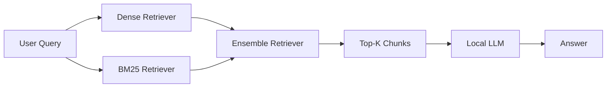

# Local RAG Pipeline

A modular local Retrieval-Augmented Generation (RAG) pipeline for document question answering using structure-aware chunking, hybrid dense-lexical retrieval, and systematic evaluation.

## Overview

This project implements a **local-first RAG pipeline** for answering questions from PDF documents. The system is designed to improve retrieval quality by combining:

- **Structure-aware chunking** based on document headers and subheaders
- **Hybrid retrieval** using dense embeddings and BM25
- **Ensemble retrieval** via rank fusion
- **Evaluation pipeline** for retrieval and generation
- **Ablation study** to analyze the impact of different context sizes (`K`)

The project is intended as a practical and extensible baseline for local document QA workflows.

## Key Features

- **Local LLM inference** with Ollama
- **PDF-to-Markdown parsing** with `pymupdf4llm`
- **Header-aware document segmentation**
- **Hybrid retrieval**
  - Dense retrieval with embeddings + Chroma
  - Sparse lexical retrieval with BM25
- **Ensemble retrieval** to combine semantic and lexical strengths
- **Retrieval and generation evaluation**
- **Ablation study for different `K` values**
- **Reusable pipeline** with separation between ingestion, retrieval, inference, and evaluation

## Why This Pipeline?

### Structure-Aware Chunking

Standard fixed-size chunking can ignore document structure. In instructional, policy, technical, or guideline documents, section headers often carry strong semantic meaning and define the scope of the content that follows.

This project uses **structure-aware chunking** to preserve document hierarchy such as:

- main sections
- sub-sections
- grouped procedural steps
- grouped rule blocks
- timeline or tabular content

The pipeline first converts the PDF to Markdown, normalizes the extracted content, splits it by Markdown headers, and only then applies recursive text splitting when sections are still too large.

Benefits include:

- better chunk coherence
- reduced semantic fragmentation
- more interpretable retrieval
- section-aware metadata for evaluation
- better grounding context for answer generation

### Hybrid Dense + BM25 Retrieval

Dense retrieval and lexical retrieval solve different retrieval problems.

**Dense retrieval** is useful for semantic similarity and paraphrased questions. It can retrieve relevant text even when the wording in the user query differs from the source document.

**BM25** is useful for exact or near-exact lexical matches, especially for:

- names
- dates
- numerical values
- identifiers
- specific terms
- exact phrases

Using only one retrieval approach can introduce avoidable failure modes. Dense retrieval may over-rank semantically related but non-answer-bearing chunks, while BM25 may miss paraphrases.

The pipeline therefore combines both retrieval signals.

### Ensemble Retrieval

The dense retriever and BM25 retriever produce independent rankings. These rankings are combined using LangChain's `EnsembleRetriever`.

The ensemble layer improves robustness across different query styles by combining:

- semantic relevance from dense embeddings
- lexical relevance from BM25

This is especially useful for document QA, where user queries may range from natural paraphrases to highly specific factual questions.

## Retrieval Workflow



## Directory Structure

```text
local-rag-pipeline/
├── chroma_db/                 # Persistent Chroma vector store
├── data/
│   └── <document>.pdf              # Source PDF document
├── .gitignore
├── ablation.py                     # Standalone K ablation study
├── ablation_k_results.csv          # Ablation summary
├── ablation_k_results.json         # Detailed ablation output
├── cleaned_document.md             # Cleaned intermediate Markdown
├── evaluation_dataset.json         # Evaluation benchmark
├── evaluation_results.json         # Detailed evaluation output
├── evaluation.py                   # Retrieval and generation evaluation
├── main.py                         # Interactive QA application
├── README.md                       # Project documentation
├── requirements.txt                # Python dependencies
└── vector.py                       # Ingestion, chunking, indexing, and retrieval
```

> Generated artifacts such as the Chroma database, cleaned documents, and evaluation outputs can be excluded from version control when appropriate.

## Core Components

### `vector.py`

Responsible for the document ingestion and retrieval pipeline:

- PDF parsing with `pymupdf4llm`
- Markdown cleaning
- table normalization
- header-aware splitting
- recursive chunking
- metadata enrichment
- Chroma vector indexing
- dense retrieval
- BM25 retrieval
- ensemble retrieval

The resulting chunks preserve section-level metadata such as the main section and sub-section, making the retrieval process easier to inspect and evaluate.

### `main.py`

Provides the interactive document QA interface.

The application:

1. accepts a user query
2. retrieves relevant chunks
3. assembles the retrieved context
4. sends the context and query to the local LLM
5. returns a grounded answer

### `evaluation.py`

Evaluates both retrieval and answer generation.

The evaluation dataset contains:

- question
- expected answer
- gold section
- gold evidence
- must-include facts
- answerability label
- query category
- query type
- difficulty

### `ablation.py`

Runs a standalone ablation study across multiple final context sizes:

```text
K = 1, 2, 3, 4, 5
```

The experiment measures how the number of retrieved chunks passed to the LLM affects:

- retrieval coverage
- answer completeness
- abstention behavior
- latency

## Evaluation

The evaluation framework separates retrieval quality from generation quality.

### Retrieval Metrics

#### Recall@K

Measures whether the gold section appears within the top `K` retrieved chunks.

Higher values indicate that the retriever is more likely to include the correct section in the context window.

#### Evidence Recall@K

Measures how much of the annotated answer-bearing evidence appears within the top `K` retrieved chunks.

This is useful when the answer can be supported by a chunk outside the primary annotated section.

#### Mean Reciprocal Rank (MRR)

Measures how highly the first relevant document is ranked.

A relevant chunk at rank 1 contributes `1.0`, rank 2 contributes `0.5`, rank 3 contributes `0.333`, and so on.

### Generation Metrics

#### Token F1

Measures token overlap between the generated answer and the expected answer.

#### ROUGE-L F1

Measures overlap based on the longest common subsequence between generated and reference answers.

#### Must-Include Recall

Measures whether critical facts required by the reference answer are present in the generated response.

This metric is particularly useful for factual QA where wording may differ while the required facts remain the same.

#### Abstention Accuracy

Measures whether the model correctly refuses to answer when the requested information is not supported by the document.

### Latency Metrics

The evaluation also tracks:

- retrieval latency
- generation latency
- total end-to-end latency

## Ablation Study

The K ablation study evaluates how many final retrieved chunks should be passed to the LLM.

The retriever configuration remains fixed while only the final context cutoff changes.

```text
Hybrid Retrieval Ranking
        |
        +--> K=1
        +--> K=2
        +--> K=3
        +--> K=4
        +--> K=5
```

This design isolates the effect of context size from the effect of candidate retrieval size.

The study reports:

- Recall@K
- Evidence Recall@K
- MRR
- Token F1
- ROUGE-L F1
- Must-Include Recall
- Abstention Accuracy
- retrieval latency
- generation latency
- total latency

## Tech Stack

- Python
- LangChain
- Ollama
- Chroma
- BM25
- PyMuPDF4LLM
- Pandas

## Installation

### 1. Clone the repository

```bash
git clone https://github.com/abidalfrz/structure-aware-rag.git
cd local-rag-pipeline
```

### 2. Create a virtual environment

#### Windows

```bash
python -m venv .venv
.venv\Scripts\activate
```

#### Linux / macOS

```bash
python -m venv .venv
source .venv/bin/activate
```

### 3. Install dependencies

```bash
pip install -r requirements.txt
```

### 4. Install Ollama

Install Ollama on your system and make sure the Ollama service is running.

Pull the required models:

```bash
ollama pull qwen2.5:3b
ollama pull mxbai-embed-large
```

### 5. Add a source document

Place the PDF document inside:

```text
data/
```

Then update `FILE_PATH` in `vector.py` if necessary.

## How to Run

### Interactive QA

```bash
python main.py
```

Example:

```text
Enter your question: When is the dataset released?
```

The application retrieves relevant chunks and generates an answer grounded in the indexed document.

### Run Evaluation

```bash
python evaluation.py
```

Output:

```text
evaluation_results.json
```

The JSON file includes:

- per-question retrieval results
- retrieved contexts
- generation outputs
- retrieval metrics
- generation metrics
- grouped metrics
- latency statistics

### Run K Ablation

```bash
python ablation.py
```

Outputs:

```text
ablation_k_results.csv
ablation_k_results.json
```

The CSV provides a compact comparison across different values of `K`, while the JSON stores detailed per-query results.

## First-Run Behavior

On the first run, the pipeline:

1. parses the source PDF
2. converts it to Markdown
3. cleans and normalizes the extracted content
4. performs structure-aware splitting
5. creates final chunks
6. generates dense embeddings
7. persists them in Chroma
8. builds the BM25 index

On subsequent runs, the persisted Chroma database can be reused.

## Design Decisions

### Why Parse PDF into Markdown?

Markdown preserves structural signals such as headings, lists, and tables more effectively than treating the extracted document as one flat text sequence.

These structural cues are used by the chunking pipeline to retain section boundaries.

### Why Normalize Tables?

Tables frequently contain high-value factual information such as:

- dates
- prices
- schedules
- scoring weights
- identifiers

The pipeline converts simple Markdown table rows into readable key-value text to improve retrieval and downstream generation.

Example:

```text
Rilis Dataset: 11 Juli 2026
```

is easier to process than raw Markdown table syntax.

### Why Enrich Chunks with Metadata?

Chunks are enriched with section metadata such as:

```text
Bab Utama
Sub Bab
source
```

This metadata supports:

- interpretable retrieval
- section-aware debugging
- section-level evaluation
- clearer context formatting for the LLM

### Why Use Local Models?

A local-first pipeline provides:

- local document processing
- control over model selection
- reproducible experimentation
- no dependency on a hosted inference API for core execution
- easier experimentation with local retrieval and generation components

## Current Limitations

- heading normalization currently includes document-specific cleaning rules
- malformed PDF extraction can still affect structure recovery
- the pipeline currently focuses on a single local document source
- no dedicated cross-encoder reranker is currently applied after ensemble retrieval
- the interface is CLI-based
- Chroma rebuild behavior is currently controlled by local database existence

## Future Work

Potential improvements include:

- add a reranker after ensemble retrieval
- introduce query rewriting or query expansion
- improve generic heading detection
- add multi-document indexing
- add configurable ingestion and retrieval settings
- support additional vector stores
- add automated experiment tracking
- add unit and integration tests
- expose the pipeline through an API or web interface
- package the retrieval pipeline as reusable modules
- evaluate alternative embedding models and fusion weights

## Acknowledgements

This project uses open-source components from:

- LangChain
- Ollama
- Chroma
- PyMuPDF4LLM
